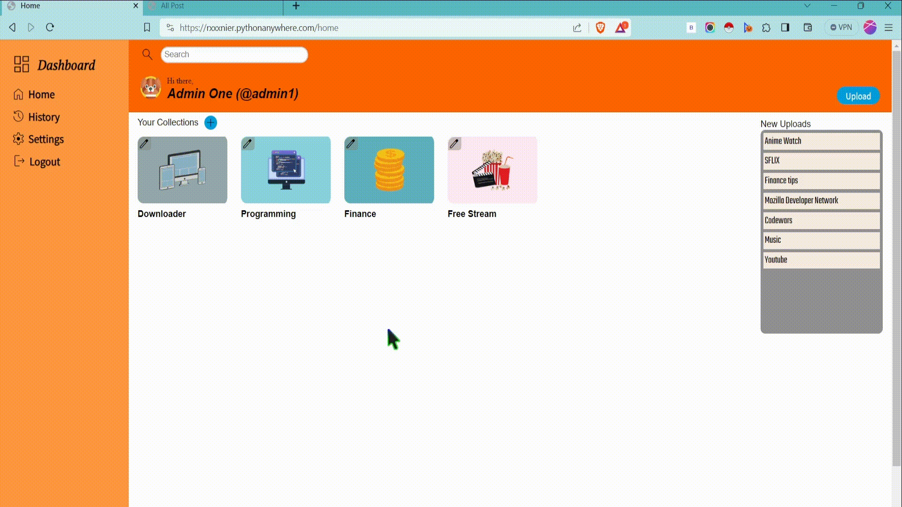

# :link:Stashport: A Link-Saving Website

## Descriptions:
In today's digital age, where information is readily available at our fingertips, managing and organizing the vast array of links we encounter can be a daunting task. Stashport emerges as a savior, offering a user-friendly and feature-rich platform to streamline link management.

## Key Features:

* **Categorization:** Stashport empowers users to create and customize categories, enabling them to structure their links in a manner that aligns with their preferences. Categories can be effortlessly renamed whenever necessary, ensuring adaptability to evolving link collections.

* **Tagging:** For enhanced organization and retrieval, Stashport facilitates tagging of links. By assigning relevant tags, users can effortlessly locate specific links, transforming the process of searching from a tedious endeavor into a streamlined experience.

* **Profile Box:** Stashport provides a dedicated profile box that displays the number of posts and categories, along with the user's profile avatar. This concise overview not only serves as a quick reference to the user's activity but also personalizes the Stashport experience.

* **Responsive Design:** Stashport seamlessly adapts to a variety of devices, from desktops to smartphones. Its responsive design ensures that users can access and manage their links with ease, regardless of their preferred platform.

* **Login/Signup Validation:** Stashport prioritizes user account security by implementing rigorous validation of login and signup information. This safeguard helps protect user accounts from unauthorized access, fostering a secure and trusted environment.

* **Link Verification:** To maintain the integrity of its link collection, Stashport meticulously verifies all links before saving them. This validation process ensures that users have access to accurate and functional links, eliminating the frustration of encountering broken or outdated links.

## Post Management:

* **Stashport** empowers users to manage their posts with granular control. *Posts* can be effortlessly deleted, tagged, and edited to ensure that the link collection remains accurate and up-to-date. Additionally, the category of a post can be modified at any time, allowing users to adapt their link structure as their needs evolve.

* **Content Editing:** Stashport provides users with the flexibility to edit the content of their posts, including the title, link, and description. This feature enables users to keep their link collection relevant and informative, ensuring that they always have access to the most accurate and up-to-date information.

* With its comprehensive feature set and user-friendly interface, **Stashport** stands as an invaluable tool for organizing and managing the ever-growing collection of links encountered in today's digital landscape. By empowering users to categorize, tag, and edit their posts, **Stashport** transforms link management from a cumbersome task into a streamlined and efficient process.
## Documentations:

## :movie_camera:Youtube:
[Watch my video on Youtube](https://youtu.be/mRK9H31zji8?si=kwr2Rd04FB9gh_9F)
## Limitations:
 * Currently, Stashport does not have forgot password functionality
 * Users cannot upload their own images for profile avatars.

 > [!NOTE]
 > This website is solely built for academic purposes and is not intended to be used for personal or commercial use.

## ABOUT CS50x
This course teaches you how to solve problems, both with and without code, with an emphasis on correctness, design, and style. Topics include computational thinking, abstraction, algorithms, data structures, and computer science more generally. Problem sets inspired by the arts, humanities, social sciences, and sciences. More than teach you how to program in one language, this course teaches you how to program fundamentally and how to teach yourself new languages ultimately.
 
[**CS50’s Introduction to Computer Science**](https://cs50.harvard.edu/x/2023/)
